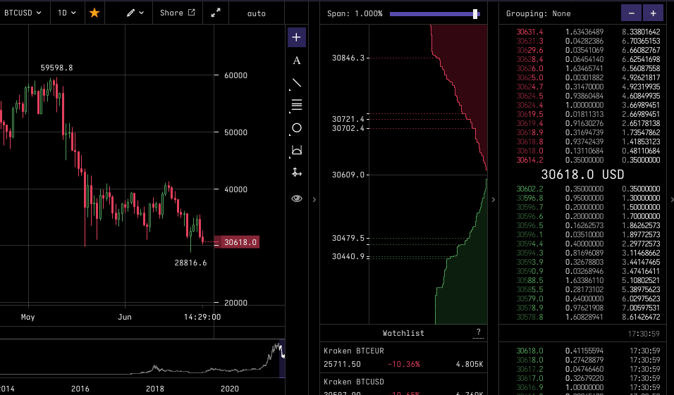

# Crypto Order Book

This is a simple order book to view recent crypto trades. For optimal frontend performance, it uses web workers to process the huge volume of updates from the websocket server. Orders are throttled before being sent to the frontend UI which handles painting the orders.

Eventually it would look like this:



This project is currently written in Javascript as a proof of concept, but will be moved to Typescript for final submission.

To run it:

```
$ npm run start
```

and then visit `localhost:3000/index.html`